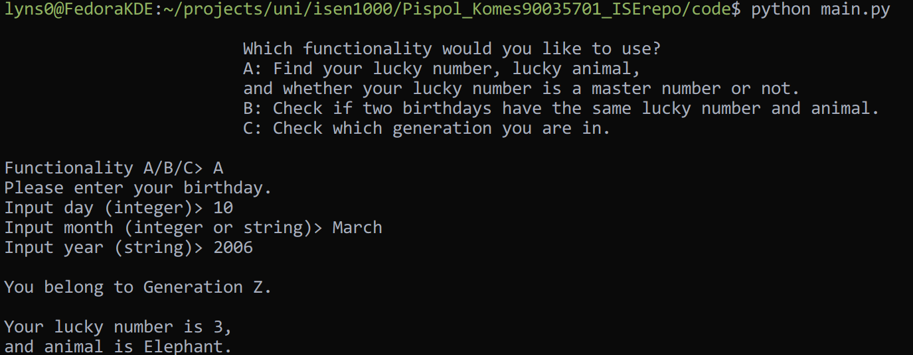
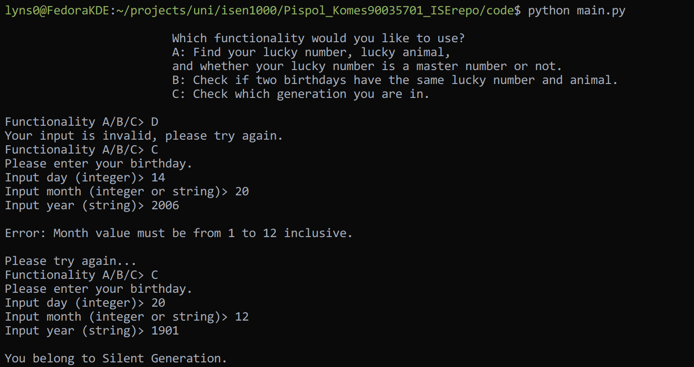
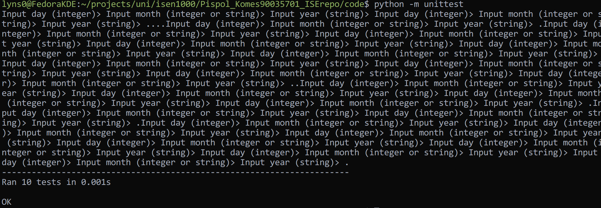
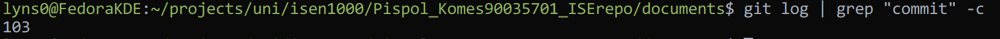

# Cover page


### Assignment
#### By Komes Pispol 90035701
#### Class Tuesday, 9:00 AM


# Introduction

I have developed a tool specialized in birthday and numerology. This application is capable of calculating a lucky number from given date and a lucky number can be translated to its respective lucky animal. It is useful for telling fortune and whether two persons are compatible with the use of lucky number and animal. This tool is also able to identify which generation a person belong to by checking their birthday against generation map. It has  a command line interface that allows users to interact with the program easily. 

This markdown document is exported to PDF using Visual Studio Code's **Markdown PDF** Extension, which may not look as desired. 

# Module descriptions
## Module calculator

```
Submodule calculate_lucky_number
Imports: birthday (Date)
Exports: lucky_number (integer)

Calculates lucky number by receiving birthday from argument. Once calculated, the lucky number is output through return value.
```

```
Submodule get_lucky_animal
Imports: lucky_number (integer)
Exports: lucky_animal (string)

Calculates lucky animal by receiving a lucky number as an argument and comparing it to a dictionary of lucky number to lucky animals. It outputs by returning the value. 
```

```
Submodule get_generation
Imports: year (integer)
Exports: generation (string)

Calculates generation of a birthday by receiving year as an argument and comparing it to a set of conditions. It returns generation as output.
```

## Module logic

```
Submodule same_luck
Imports: birthday1 (Date), birthday2 (Date)
Exports: result (boolean)

Checks if two dates have the same lucky number and lucky animal by receiving birthday1 and birthday2 as arguments, then call calculate_lucky_number for each birthday and compare the results. It returns True if both have the same lucky number, and False if not.
```

```
Submodule is_master_number
Imports: lucky_number (integer)
Exports: result (boolean)

Checks if a lucky number is a master number by receiving lucky number as argument and check if the number is in the list of master numbers of not. If it is in the list, return True. If it is not, return False.
```

## Module date

```
Class Date
Imports: None

Stores day, month, year in integer format.
```

```
Method prompt_date
Imports: None
Exports: None

Prompts for user input for day, month, and year, validifies if they are in correct formats and calls format_month to format month if month is not a digit. Finally, it modifies class members day, month, year with new values.
```

```
Method format_month
Imports: None
Exports: month (integer)

Formats month to integer by using a dictionary that maps month strings to integers and return the integer. 
```

### Explanation

I have designed so that each submodule satisfies each requirement without doing too many things at once in the same submodule. Each module only contains submodule with related functionalities for scalability.

### Assumptions

It is assumed that, in `get_generation()`, `year` is passed from a `Date()` object, meaning the input type is automatically validated. This means that in order to use    
`get_generation()`, you need to create a `Date()` object and call `prompt_date()` to take in inputs.

# Modularity
### Instructions

The code can be run by running `python3 main.py`. The user interface will appear, prompting to choose a scenario to run. 

- Scenario A queries your birthday and outputs your generation, lucky number, animal, and check whether your lucky number is a master number or not.
- Scenario B queries two birthdays and outputs whether they have the same lucky number and animal or not.
- Scenario C queries your birthday and outputs the generation you belong to.

If your scenario selection input is invalid, it will prompt until you enter a correct input.
You need to rerun the code if you would like to try another scenario. 




### Modularity Checklist
| No. | Question                        | Yes/No | Where |
| --- | ------------------------------- | ------ | ----- |
|     | **Coupling**                    |        |       |
| 1   | More than 6 function parameters | No     |       |
| 2   | Global variables                | No     |       |
| 3   | Control flags                   | No     |       |
|     | **Cohesion**                    |        |       |
| 4   | Sequential tasks                | No     |       |
| 5   | Different kinds of data         | No     |       |
|     | **Redundancy**                  |        |       |
| 6   | Duplication                     | No     |       |
| 7   | Supersets                       | No     |       |

In the code shows that each submodule only does what it is meant to do, which shows separation of concern. However, a submodule can also call other modules to help complete its task to avoid Redundancy when two submodule has a similar sub-task. For example, `calculate_lucky_number()` makes use `is_master_number()` as a part of its calculation while `is_master_number()` can also be used elsewhere, which is user interface in this case.
Each module is designed with modularity in mind from the beginning to avoid too many refactoring.

# Black-box test cases
### Module calculator
#### Submodule calculate_lucky_number
##### Equivalence Partitioning
| No. | Category          | Input<br>birthday   | Expected Output<br>lucky_number |
| --- | ----------------- | ------------------- | ------------------------------- |
| 1   | Not master number | = Date(10, 3, 2006) | 3                               |
| 2   | Master number     | = Date(6, 6, 2017)  | 22                              |

#### Submodule get_lucky_animal
##### Equivalence Partitioning
| No. | Category<br>lucky_number<br>                      | Input<br>lucky_number | Expected Output<br>lucky_animal |
| --- | ------------------------------------------------- | --------------------- | ------------------------------- |
| 1   | == 1                                              | = 1                   | "Parrot"                        |
| 2   | == 2                                              | = 2                   | "Rabbit"                        |
| 3   | == 3                                              | = 3                   | "Elephant"                      |
| 4   | == 4                                              | = 4                   | "Beetles"                       |
| 5   | == 5                                              | = 5                   | "Bears"                         |
| 6   | == 6                                              | = 6                   | "Deer"                          |
| 7   | == 7                                              | = 7                   | "Crane"                         |
| 8   | == 8                                              | = 8                   | "Horse"                         |
| 9   | == 9                                              | = 9                   | "Fish"                          |
| 10  | == 11                                             | = 11                  | "Dolphin"                       |
| 11  | == 22                                             | = 22                  | "Lion"                          |
| 12  | == 33                                             | = 33                  | "Turtle"                        |
| 13  | Not in range 1-9 inclusive and not 11, 22, and 33 | = 0                   | ""                              |

#### Submodule get_generation
##### Equivalence Partitioning
| No. | Category             | Input<br>year | Expected Output<br>generation |
| --- | -------------------- | ------------- | ----------------------------- |
| 1   | 1901 <= year <= 1945 | = 1930        | "Silent Generation"           |
| 2   | 1946 <= year <= 1964 | = 1950        | "Baby Boomers"                |
| 3   | 1965 <= year <= 1979 | = 1970        | "Generation X"                |
| 4   | 1980 <= year <= 1994 | = 1990        | "Millennials"                 |
| 5   | 1995 <= year <= 2009 | = 2000        | "Generation Z"                |
| 6   | 2010 <= year <= 2024 | = 2020        | "Generation Alpha"            |
##### Boundary Value Analysis
| No. | Category                         | Input<br>                  | Expected Output<br>generation         |
| --- | -------------------------------- | -------------------------- | ------------------------------------- |
| 1   | Silent Generation / Baby Boomers | year = 1945<br>year = 1946 | "Silent Generation"<br>"Baby Boomers" |
| 2   | Baby Boomers / Generation X      | year = 1964<br>year = 1965 | "Baby Boomers"<br>"Generation X"      |
| 3   | Generation X / Millennials       | year = 1979<br>year = 1980 | "Generation X"<br>"Millennials"       |
| 4   | Millennials / Generation Z       | year = 1994<br>year = 1995 | "Millennials"<br>"Generation Z"       |
| 5   | Generation Z / Generation Alpha  | year = 2009<br>year = 2010 | "Generation Z"<br>"Generation Alpha"  |

### Module logic
#### Submodule same_luck
##### Equivalence Partitioning
| No. | Category<br>                                                                 | Input<br>                                        | Expected Output<br>result |
| --- | ---------------------------------------------------------------------------- | ------------------------------------------------ | ------------------------- |
| 1   | Lucky number of birthday1 <br>is equal to <br>lucky number of birthday 2     | birthday1 = 9, 7, 2005<br>birthday2 = 8, 8, 2005 | True                      |
| 2   | Lucky number of birthday1 <br>is NOT equal to <br>lucky number of birthday 2 | birthday1 = 9, 7, 2005<br>birthday2 = 8, 9, 2005 | False                     |

#### Submodule is_master_number
##### Equivalence Partitioning
| No. | Category<br>lucky_number | Input<br>lucky_number | Expected Output<br>result |
| --- | ------------------------ | --------------------- | ------------------------- |
| 1   | == 11                    | = 11                  | True                      |
| 2   | == 22                    | = 22                  | True                      |
| 3   | == 33                    | = 33                  | True                      |
| 4   | != 11                    | = 20                  | False                     |
| 5   | != 22                    | = 14                  | False                     |
| 6   | != 33                    | = 43                  | False                     |

### Module date
#### Class Date
#### Method prompt_date
##### Equivalence Partitioning
| No. | Category<br>                                                           | Input<br>                                  | Expected Output<br>result |
| --- | ---------------------------------------------------------------------- | ------------------------------------------ | ------------------------- |
| 1   | Day = 1-31, <br>Month = 1-12, <br>Year = 1901-2024 <br>(all inclusive) | day = 10<br>month = 3 <br>year = 2006      | (10, 3, 2006)             |
| 2   | String month                                                           | day = 10<br>month = "March"<br>year = 2006 | (10, 3, 2006)             |
| 3   | Invalid day                                                            | day = 0<br>month = 2<br>year = 2001        | ValueError                |
| 4   | Invalid month                                                          | day = 10<br>month = 0<br>year = 1999       | ValueError                |
| 5   | Invalid year                                                           | day = 20<br>month = 4<br>year = 9999       | ValueError                |
| 6   | Invalid day and month                                                  | day = -1<br>month = 0<br>year = 2024       | ValueError                |
| 7   | Invalid month and year                                                 | day = 4<br>month = 99<br>year = 2193       | ValueError                |
| 8   | Invalid day and year                                                   | day = 111<br>month = 12<br>year = 9        | ValueError                |
| 9   | Invalid day, month, and year                                           | day = 99<br>month = 99<br>year = 9999      | ValueError                |

#### Method format_month
##### Equivalence Partitioning
| No. | Category<br>                    | Input<br>month | Expected Output<br>month |
| --- | ------------------------------- | -------------- | ------------------------ |
| 1   | January                         | = "January"    | 1                        |
| 2   | February                        | = "February"   | 2                        |
| 3   | March                           | = "March"      | 3                        |
| 4   | April                           | = "April"      | 4                        |
| 5   | May                             | = "May"        | 5                        |
| 6   | June                            | = "June"       | 6                        |
| 7   | July                            | = "July"       | 7                        |
| 8   | August                          | = "August"     | 8                        |
| 9   | September                       | = "September"  | 9                        |
| 10  | October                         | = "October"    | 10                       |
| 11  | November                        | = "November"   | 11                       |
| 12  | December                        | = "December"   | 12                       |
| 13  | Jan                             | = "Jan"        | 1                        |
| 14  | Feb                             | = "Feb"        | 2                        |
| 15  | Mar                             | = "Mar"        | 3                        |
| 16  | Apr                             | = "Apr"        | 4                        |
| 17  | Jun                             | = "Jun"        | 6                        |
| 18  | Jul                             | = "Jul"        | 7                        |
| 19  | Aug                             | = "Aug"        | 8                        |
| 20  | Sep                             | = "Sep"        | 9                        |
| 21  | Sept                            | = "Sept"       | 9                        |
| 22  | Oct                             | = "Oct"        | 10                       |
| 23  | Nov                             | = "Nov"        | 11                       |
| 24  | Dec                             | = "Dec"        | 12                       |
| 25  | All lowercase                   | = "jan"        | 1                        |
| 26  | All uppercase                   | = "JAN"        | 1                        |
| 27  | String does not match any month | = "Jupiter"    | ValueError               |

# White-box test cases
### Module calculator
#### Submodule calculate_lucky_number
| No. | Path            | Test Data                    | Expected Output   |
| --- | --------------- | ---------------------------- | ----------------- |
| 1.  | Do not enter if | birthday = Date(10, 3, 2006) | lucky_number = 3  |
| 2.  | Enter if        | birthday = Date(6, 6, 2017)  | lucky_number = 22 |

### Module date
#### Method prompt_date
| No. | Path<br>                                       | Test Data                                   | Expected Output |
| --- | ---------------------------------------------- | ------------------------------------------- | --------------- |
| 1   | Enter first if, do not enter second if         | day = 10<br>month = "march" <br>year = 2006 | (10, 3, 2006)   |
| 2   | Enter first if, enter second if                | day = 44<br>month = "april"<br>year = 2006  | ValueError      |
| 3   | Enter 1st if, enter 2nd else of 2nd if         | day = 14<br>month = "may"<br>year = 200     | ValueError      |
| 4   | Enter else of 1st if, do not enter second if   | day = 12<br>month = 9<br>year = 2004        | (12, 9, 2004)   |
| 5   | Enter else of 1st if, enter 2nd if             | day = -1<br>month = 4<br>year = 2024        | ValueError      |
| 6   | Enter else of 1st if, enter 1st else of 2nd if | day = 4<br>month = 99<br>year = 1945        | ValueError      |
| 7   | Enter else of 1st if, enter 2nd else of 2nd if | day = 9<br>month = 12<br>year = 2174        | ValueError      |


# Test implementation and test execution

I have implemented test cases for each submodule in Black-Box Test Cases section. Most of test cases are in form of Equivalence Partitioning. One test case is in form of Boundary Value Analysis, which is submodule `get_generation()`, which I deemed appropriate.

As for White-Box testing, I have chosen `calculate_lucky_number()` and `prompt_date()`
as their paths affect their processes.

All test cases can be executed as follows,
```
python3 -m unittest
```
Note that this command needs to be executed inside `code/` directory

The result is that all test cases passed as expected.

The debug processes can be seen in the Version Control section.

# Traceability Matrix
### Design | Implementation

| Module name            | BB (EP) | BB (BVA) | WB   | Data types            | Form of IO                                                  | EP   | BVA  | WB   |
| ---------------------- | ------- | -------- | ---- | --------------------- | ----------------------------------------------------------- | ---- | ---- | ---- |
| calculate_lucky_number | Done    | -        | Done | Date -> integer       | Input: <br>Parameter<br>Output:<br>Return                   | Done | -    | Done |
| get_lucky_animal       | Done    | -        | -    | integer -> string     | Input: <br>Parameter<br>Output:<br>Return                   | Done | -    | -    |
| get_generation         | Done    | Done     | -    | integer -> string     | Input: <br>Parameter<br>Output:<br>Return                   | Done | Done | -    |
| same_luck              | Done    | -        | -    | Date -> boolean       | Input: <br>Parameter<br>Output:<br>Return                   | Done | -    | -    |
| is_master_number       | Done    | -        | -    | integer -> boolean    | Input: <br>Parameter<br>Output:<br>Return                   | Done | -    | -    |
| prompt_date            | Done    | -        | Done | string<br>-> Date     | Input: <br>Keyboard<br>Output:<br>Class member modification | Done | -    | Done |
| format_month           | Done    | -        | -    | string <br>-> integer | Input: <br>Parameter<br>Output:<br>Return                   | Done | -    | -    |
# Version control

As my version control log is very long. I believe it is impractical to take a screenshot. 



So, I used this command instead.

`git log --pretty=format:"%h%x09%an%x09%ad%x09%s" > git.log`

`git.log` can be found in `documents/` directory.

```
8957ac5 Komes Pispol Wed May 7 11:24:51 2025 +0800 Fix: some spacings in report

26a41df Komes Pispol Wed May 7 11:20:47 2025 +0800 Refactor: edited formatting, replaced unittest image with latest, and correct spellings

862e303 Komes Pispol Wed May 7 11:04:01 2025 +0800 Fix: report whitebox fixed expected output on prompt_date path 4

a2a86b2 Komes Pispol Wed May 7 11:02:59 2025 +0800 Add: test_whitebox

4bbb51e Komes Pispol Wed May 7 10:53:27 2025 +0800 Chore: fixed newline formatting in report

bcd95c6 Komes Pispol Wed May 7 10:52:40 2025 +0800 Update: report, added white box test cases

04096f2 Komes Pispol Tue May 6 12:54:43 2025 +0800 Update: report discussion section

72dd4a8 Komes Pispol Tue May 6 12:33:14 2025 +0800 Chore: changed an unchanged date module name

7895de4 Komes Pispol Tue May 6 12:31:46 2025 +0800 Update: added new images for code running instructions

2a38084 Komes Pispol Tue May 6 12:22:39 2025 +0800 Update: included explanation and assumption in module description section

52ab45b Komes Pispol Tue May 6 09:07:53 2025 +0800 Update: report expanded discussion part

ed6c088 Komes Pispol Mon May 5 19:15:02 2025 +0800 Merge branch 'design' into implementation

3cabfc9 Komes Pispol Mon May 5 19:14:55 2025 +0800 Update: added docstring to each submodule

c4ccec5 Komes Pispol Mon May 5 19:11:05 2025 +0800 Update: made traceability matrix more comprehensible

eb59a95 Komes Pispol Mon May 5 19:04:56 2025 +0800 Update: report expanded Modularity section

93db97f Komes Pispol Mon May 5 18:45:10 2025 +0800 Refactor: applied data_structures module name change

e3d00c2 Komes Pispol Mon May 5 18:44:00 2025 +0800 Refactor: changed module name data_structures to date

c97fbfd Komes Pispol Mon May 5 18:42:36 2025 +0800 Refactor: changed module name data_structures to date and applied refactors from implementation

937c079 Komes Pispol Mon May 5 18:34:48 2025 +0800 Refactor: changed keyboard simulation method from patch to io + sys

6803998 Komes Pispol Mon May 5 18:19:47 2025 +0800 Merge branches 'implementation' and 'design' into testing so that test cases can be adjusted to accommodate refactored design

b92184c Komes Pispol Mon May 5 18:18:42 2025 +0800 Refactor: Date to not call prompt_date() at initialization and let frontend handle that instead

cd89b61 Komes Pispol Mon May 5 15:20:48 2025 +0800 Update: report module description, described what each submodule does in detail.

40e99b3 Komes Pispol Mon May 5 14:45:50 2025 +0800 Update: changed some test cases to use last name and last four digits of student id

3d0df02 Komes Pispol Mon May 5 14:08:05 2025 +0800 Update: report Modularity added instructions for running code correctly

1a30ffa Komes Pispol Sat May 3 17:06:36 2025 +0800 Add: implemented main.py

b3aa80a Komes Pispol Sat May 3 16:58:29 2025 +0800 Update: changed test same_luck to accomodate keyboard input testing

b0fc3ff Komes Pispol Sat May 3 16:55:37 2025 +0800 Update: enable lucky_number to take parameter

65667c5 Komes Pispol Sat May 3 16:53:22 2025 +0800 Update: test_same_luck to test keyboard input

c03811f Komes Pispol Sat May 3 16:40:49 2025 +0800 Update: changed same_luck to handle keyboard input instead of parameter

5593957 Komes Pispol Sat May 3 16:35:46 2025 +0800 Update: test cases that rely on Date to test by simulating keyboard input

0910afc Komes Pispol Sat May 3 16:29:57 2025 +0800 Update: lucky number to take keyboard input instead

0c4251c Komes Pispol Sat May 3 16:28:15 2025 +0800 Update: to take keyboard input instead

98c7848 Komes Pispol Sat May 3 16:15:30 2025 +0800 Merge branch 'design' into implementation

d98629b Komes Pispol Sat May 3 16:14:48 2025 +0800 Update: test for lucky number to test keyboard input instead

39a439b Komes Pispol Sat May 3 16:08:55 2025 +0800 Update: changed prompt_date and calculate_lucky_number's input method to keyboard input

f28c694 Komes Pispol Sat May 3 15:57:43 2025 +0800 Update: changed test_constructor to test_prompt_date and test using keyboard input simulation

7059224 Komes Pispol Sat May 3 15:48:32 2025 +0800 Refactor: constructor test case and module is now a separate method called prompt_date

464b446 Komes Pispol Sat May 3 15:42:02 2025 +0800 Fix: prompt_date not converting input to int before constructing Date

febf5fa Komes Pispol Sat May 3 15:31:31 2025 +0800 Add: implemented main

2fae4d6 Komes Pispol Sat May 3 11:23:25 2025 +0800 Update: report test implementation and test execution section, and added screenshot

b1f9cd5 Komes Pispol Sat May 3 11:02:55 2025 +0800 Update: implemented BVA for test_get_generation

7dec565 Komes Pispol Sat May 3 10:54:29 2025 +0800 Update: updated traceability matrix according to tasks fulfilled

0c889da Komes Pispol Sat May 3 10:52:04 2025 +0800 Update: added BVA for get_generation

709f64b Komes Pispol Sat May 3 10:44:25 2025 +0800 Refactor: design, reformatted blackbox testing for each module

c6478d1 Komes Pispol Sat May 3 10:41:45 2025 +0800 Add: design, traceability matrix

e2cd714 Komes Pispol Fri May 2 15:50:21 2025 +0800 Update: constructor valid test cases to expect (day, month, year) instead of None

8f946b8 Komes Pispol Fri May 2 15:46:27 2025 +0800 Fix: format month called before turning month into integer

9c90569 Komes Pispol Fri May 2 15:42:54 2025 +0800 Fix: test constructor to compare expected and actual value properly

3af002d Komes Pispol Fri May 2 15:23:44 2025 +0800 Fix: test data structure to handle exceptions

496cc0b Komes Pispol Fri May 2 15:19:46 2025 +0800 Fix: format month to handle keyerror

21c8199 Komes Pispol Fri May 2 15:10:37 2025 +0800 Fix: to call format_month from test_date

72108e5 Komes Pispol Fri May 2 15:07:34 2025 +0800 Fix: called is_instance incorrectly

f9a236c Komes Pispol Fri May 2 12:29:40 2025 +0800 Chore: removed pycache from tracking

4cf6b9f Komes Pispol Fri May 2 12:26:24 2025 +0800 Update: gitignore to ignore .pyc

08cfb58 Komes Pispol Fri May 2 12:23:46 2025 +0800 Update: gitignore to ignore pycache

45b7778 Komes Pispol Fri May 2 12:21:01 2025 +0800 Update: implemented additional test cases for test_data_structure

dfc8134 Komes Pispol Fri May 2 11:58:50 2025 +0800 Update: design, added more test cases for format_month

0a51877 Komes Pispol Fri May 2 11:54:55 2025 +0800 Update: design, formatted date constructor test cases

d996328 Komes Pispol Fri May 2 11:48:58 2025 +0800 Add: implemented test date constructor

b932a4c Komes Pispol Fri May 2 11:48:26 2025 +0800 Update: test case for calculate_lucky_number to handle master number and not master number

c2959ac Komes Pispol Fri May 2 11:32:41 2025 +0800 Update: design (report) submodule calculate_lucky_number updated to have proper cases and fixed expected outputs

1913bf5 Komes Pispol Fri May 2 11:28:41 2025 +0800 Update: design (report) added test case for Date constructor

8cecd02 Komes Pispol Fri May 2 11:20:59 2025 +0800 Update: reverted tuples imports to date

9d04a86 Komes Pispol Fri May 2 11:10:45 2025 +0800 Add: Implemented format_month

c5e5ca8 Komes Pispol Fri May 2 11:05:25 2025 +0800 Add: implemented test case for format_month

57ecc69 Komes Pispol Fri May 2 10:59:37 2025 +0800 Update: report add test case for class date, format month method

ab355c3 Komes Pispol Fri May 2 10:47:32 2025 +0800 Update: report replaced submodule imports that are Date with tuble

2086e2e Komes Pispol Fri May 2 10:41:11 2025 +0800 Update: made Date able to take month as string and updated related submodules

6327e1c Komes Pispol Fri May 2 10:34:32 2025 +0800 Chore: fixed indentation for files

33064cd Komes Pispol Thu May 1 15:44:15 2025 +0800 Update: changed test_calculate_lucky_number to handle exceptions better

742ba25 Komes Pispol Thu May 1 15:37:57 2025 +0800 Refactor: ValueError in calculate_lucky_number is now raised in Date class

8d1ea0a Komes Pispol Thu May 1 11:36:24 2025 +0800 Fix: calculate lucky number to not include error message in invalid cases

51c7dec Komes Pispol Thu May 1 11:33:45 2025 +0800 Fix: calculate_lucky_number to handle invalid date

1b1e63b Komes Pispol Thu May 1 11:16:58 2025 +0800 Fix: test cases for is_master_number and calculate_lucky_number

a31d9fc Komes Pispol Thu May 1 11:12:42 2025 +0800 Add: implemented get_generation

563c454 Komes Pispol Thu May 1 11:07:46 2025 +0800 Add: implemented get_lucky_animal

408a32d Komes Pispol Thu May 1 10:55:17 2025 +0800 Add: implemented calculate_lucky_number

487a381 Komes Pispol Thu May 1 09:06:53 2025 +0800 Update: implemented all submodules for logic module

e5683d9 Komes Pispol Thu May 1 09:00:12 2025 +0800 Add: placeholder functions for calculator and logic modules

7200c08 Komes Pispol Thu May 1 08:56:19 2025 +0800 Refactor: made all test case messages of test calculator module more comprehensible

3d52b46 Komes Pispol Thu May 1 08:54:22 2025 +0800 Add: test code for same_luck and is_master_number

1e692ac Komes Pispol Thu May 1 08:43:37 2025 +0800 Merge branch 'design' into testing to apply the new design.

abc68fe Komes Pispol Thu May 1 08:43:14 2025 +0800 Refactor: moved is_master_number to module logic instead of calculator

06e161b Komes Pispol Thu May 1 08:41:07 2025 +0800 Add: test code for get_generation

e7e2f3d Komes Pispol Thu May 1 08:38:13 2025 +0800 Add: test code for get_lucky_animal

a9ec886 Komes Pispol Wed Apr 30 19:43:03 2025 +0800 Add: test_calculator, added test case for calculate_lucky_number

5cf9952 Komes Pispol Wed Apr 30 19:26:41 2025 +0800 Add: implemented data_structure.py

3b7496a Komes Pispol Wed Apr 30 18:59:06 2025 +0800 Update: gitignore added .zip

9e802c0 Komes Pispol Wed Apr 30 16:36:10 2025 +0800 Update: added placeholder for Cover page, introduction, modularity, white box, summary, version control, and discussion

63d745a Komes Pispol Wed Apr 30 16:27:28 2025 +0800 Update: report black box added submodule same_luck

2e10393 Komes Pispol Wed Apr 30 16:15:52 2025 +0800 Refactor: report changed variable names for submodule get_generation in module desc

3c04d5f Komes Pispol Wed Apr 30 16:14:03 2025 +0800 Update: report black box section added get_lucky_animal and get_generation submodules

bbf14eb Komes Pispol Tue Apr 29 09:07:12 2025 +0800 Refactor: report formatted modules into code blocks

77dd50f Komes Pispol Mon Apr 28 16:45:48 2025 +0800 Update: report add black box test case for calculate_lucky_number

6764061 Komes Pispol Mon Apr 28 16:25:45 2025 +0800 Update: report add black box test case for is_master_number

2d44177 Komes Pispol Mon Apr 28 16:09:12 2025 +0800 Update: report submodule get_generation now exports string instead of boolean

cba1745 Komes Pispol Mon Apr 28 15:58:51 2025 +0800 Update: report, renamed module analyzer to logic and added module data_structures containing class Date

46fc36b Komes Pispol Sat Apr 26 15:47:02 2025 +0800 Update: report module section added module calculator and module analyzer

5cf61fc Komes Pispol Sat Apr 26 15:40:45 2025 +0800 Update: report add sections

daf3db3 Komes Pispol Sat Apr 26 15:40:09 2025 +0800 Add: gitignore for .obsidian

4decfde Komes Pispol Sat Apr 26 15:13:50 2025 +0800 Add: initialized report markdown

a73641b Komes Pispol Sat Apr 26 15:08:39 2025 +0800 Initial commit
```

# Discussion

I started this project by writing module descriptions in order to develop black box test cases first and foremost. With that, I have experienced test-driven development for the first time. It is convenience that each implementation can immediately be verified whether it is working as intended or not, using Black-Box test cases. However, the module design had improved over time, leading to modification of test cases and documentation. This in turn led to multiple context switching, having to switch branches every few modifications, which is tedious for a solo development. 

I believe that my work flow would be better if I had understood every requirement at the beginning. There were times that I would misunderstand a requirement halfway and had to rewrite every part, including report, test code, and production code. Some changes led to chain reactions that I had to apply the change I made on one submodule and a few other modules. But ultimately, I had to change the code back when I had finally understood the requirement because I couldn't use `git reset` when I have already made new features over the misunderstood changes. This taught me that branches should not be defined from start but should be created as I need, so that `git reset` can actually be useful. 

In the end, this assignment effectively taught me how to use git version control effectively, how to use merge, and when to branch.